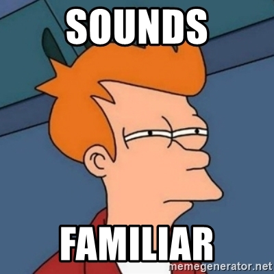
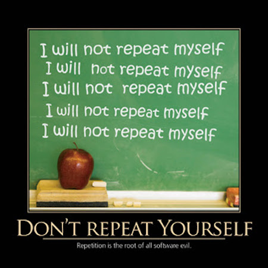
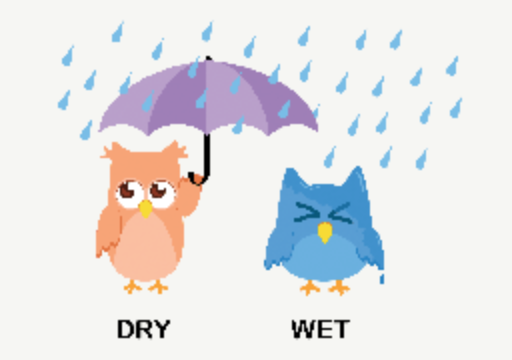
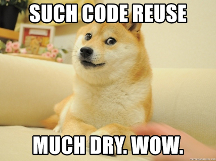

Don't Repeat Yourself (DRY)
---------------------------


### Don't Repeat Yourself (DRY)



We got a glimpse of this last topic (optional params)


### Not an OOP-specific Principle, very important in any paradigm




### 👎 WET: Write Everything Twice
### 👎 WET: We Enjoy Typing




### 👎 WET Code is difficult and costly to maintain (1/2)

* Maintenance means:
  - Perfective Maintance: adding enhancements to software
  - Corrective Maintenance: fixing bugs
  - Adaptive Maintenance: change underlying technology to a newer one
    + or support new platforms or hardware
  - Preventive Maintenance:  prevents future headaches


### 👎 WET Code is difficult and costly to maintain (2/2)

What happens if you change one method but forget to change the other?

```diff
void bark() {
- print("Arf!");
+ // according to research, dogs should bark like this
+ print("Woof!");
}

void alertOwners() {
  print("Arf!");
  print("Arf!");
  print("Arf!");
}
```


### 👍 DRY Code only needs changes in a single location

```diff
void bark() {
- print("Arf!");
+ // according to research, dogs should bark like this
+ print("Woof!");
}

void alertOwners() {
  for (var i = 1; i <= 3; i++) {
    bark();
  }
}
```

Alerting the owners also produces the newly-researched Woof! sound.


### Rule of Three

Rule of three ("Three strikes and you refactor") is a code refactoring rule of thumb to decide when 
similar pieces of code should be refactored to avoid duplication. It states that two instances of 
similar code don't require refactoring, but when similar code is used three times, it should be 
extracted into a new ~~procedure~~ method.

BUT feel free to refactor even when you repeat some code for the first time.


### Let's add fractions

```dart [2-9 | 11-18]
class Fraction {
  Fraction add(Fraction other) {
    // using var so code can fit horizontally in slides
    var newDenominator = denominator * other.denominator;
    var newNumerator = numerator * other.denominator +
                       denominator * other.numerator;
    var result = Fraction(newNumerator, newDenominator);
    return result.simplify();
  }

  Fraction subtract(Fraction other) {
    // using var so code can fit horizontally in slides
    var newDenominator = denominator * other.denominator;
    var newNumerator = numerator * other.denominator -
                       denominator * other.numerator;
    var result = Fraction(newNumerator, newDenominator);
    return result.simplify();
  }

  // other methods like simplify
}
```

Is our code repetitive? <!-- .element class="fragment" -->


### Let's use some math tricks

```dart [2-9 | 10-17]
class Fraction {
  Fraction add(Fraction other) {
    // using var so code can fit horizontally in slides
    var newDenominator = denominator * other.denominator;
    var newNumerator = numerator * other.denominator +
                       denominator * other.numerator;
    var result = Fraction(newNumerator, newDenominator);
    return result.simplify();
  }

  Fraction negate() {
    return Fraction(-numerator, denominator);
  }

  Fraction subtract(Fraction other) {
    return add(other.negate());
  }

  // other methods like simplify
}
```

Can you do `multiply` and `divide`?  #stayDRY


### DRY Code is reused code



> Don't reinvent the wheel.


### Think first before you


I can PM you the Shopee link for this keyboard <!-- .element class="fragment" -->


### Maybe your WET code is one parameter away from being DRY (1/2)

```dart 
class Dog {
  void barkLoudly(int times) {
    for (var i = 0; i < times; i++) {
      stdout.write("ARF! ");
    }
    print('');
  }

  void barkSoftly(int times) {
    for (var i = 0; i < times; i++) {
      stdout.write("Arf! ");
    }
    print('');
  }
}
```


### Maybe your WET code is one parameter away from being DRY (2/2)

```dart 
class Dog {
  void bark(int times, bool loud) {
    for (var i = 0; i < times; i++) {
      stdout.write(loud ? 'ARF! ' : 'Arf! ');
    }
    
    print('');
  }
}
```

Method names with the same _"prefix"_, and differ by a few characters, and same code/logic inside
are a clear giveaway that extra parameters are waving.


### Maybe your WET code is one method away from being DRY (1/3)

```dart [2-10 | 12-18 | 3 | 13] 
class Dog {
  void bark() {
    if (weight < 40) {
      print("Yip!");
    } else if (weight < 80) {
      print("Arf!");
    } else {
      print("Woof!");
    }
  }

  String get recommendedPetFood {
    if (weight < 40) {
      return 'Pedigree Mini';
    } else {
      return 'Pedigree Adult';
    }
  }
}
```


### Maybe your WET code is one method away from being DRY (2/3)

DOST: Mini dogs are now those 30 kg and below.

```dart [3 | 13] 
class Dog {
  void bark() {
    if (weight < 30) {
      print("Yip!");
    } else if (weight < 80) {
      print("Arf!");
    } else {
      print("Woof!");
    }
  }

  String get recommendedPetFood {
    if (weight < 40) { // forgot something?
      return 'Pedigree Mini';
    } else {
      return 'Pedigree Adult';
    }
  }
}
```


### Maybe your WET code is one method away from being DRY (3/3)

DOST: Mini dogs are now those 30 kg and below.

```dart [2-11 | 13-24 | 26-32] 
class Dog {
  // getters can work in place of methods
  String get _size { // public maybe better in some cases
    if (weight < 30) {
      return 'mini';
    } else if (weight < 80) {
      return 'medium';
    } else {
      return 'large';
    }
  }

  void bark() {
    switch (_size) {
      case 'mini':
        print('Yip!');
        break;
      case 'medium':
        print('Arf!');
        break;
      default:
        print('Woof!');
    }
  }

  String get recommendedPetFood {
    if (_size == 'mini') {
      return 'Pedigree Mini';
    } else {
      return 'Pedigree Adult';
    }
  }
}
```


### What if somebody types `small` rather than `mini`?

```dart [2-11 | 13-24 | 26-32] 
class Dog {
  // getters can work in place of methods
  String get _size { // public maybe better in some cases
    if (weight < 30) {
      return 'mini';
    } else if (weight < 80) {
      return 'medium';
    } else {
      return 'large';
    }
  }

  void bark() {
    switch (_size) {
      case 'small': 
        print('Yip!');
        break;
      case 'medium':
        print('Arf!');
        break;
      default:
        print('Woof!'); // BUG: small dog barks are Woof!
    }
  }

  String get recommendedPetFood {
    if (_size == 'mini') {
      return 'Pedigree Mini';
    } else {
      return 'Pedigree Adult';
    }
  }
}
```


### Dart is a strongly-typed language

* Take advantage of the type-system.  
  - Strings for data that have a few valid values is not considered strongly-typed
  - In fact, it's often spoofed as **stringly-typed** code
  - imagine using `'true'` and `'false'` strings, and comparing with typos like
    + treu, True (#guidoIsWaving), fasle
  - Give other examples of data that can only have a few values:
    + gender
    + civil status
    + your example? (show-off on this Canvas discussion)


### Enumerated Types

+ a.k.a. enumerations, enums
  - special kind of class used to represent a **fixed number of constant values**.

Dart convention is to use camelCase, some other languages use SCREAMING_SNAKE_CASE.

```dart
// gender.dart
enum Gender { male, female } // Genesis 1:27, ❌ LGBTQ+

// elsewhere.dart
var gender = Gender.female; // OK
var gender = Gender.femmale; // compile-error
var gender = Gender.gay; // compile-error

// when you create an enum, you create a new data type
```


### Refactoring size to use enums

```dart [1 | 3-13 | 15-26 | 28-32] 
enum DogSize { mini, medium, large }

class Dog {
  DogSize get _size { // public maybe better in some cases
    if (weight < 30) {
      return DogSize.mini;
    } else if (weight < 80) {
      return DogSize.medium;
    }
    
    // some style guides prefer this "style"
    return DogSize.large; 
  }

  void bark() {
    switch (_size) {
      case DogSize.mini: // DogSize.small won't compile!
        print('Yip!');
        break;
      case DogSize.medium:
        print('Arf!');
        break;
      default:
        print('Woof!');
    }
  }

  String get recommendedPetFood {
    return _size == DogSize.mini
      ? 'Pedigree Mini'
      : 'Pedigree Adult';
  }
}
```

- WET? ❌
- Stringly-typed? ❌