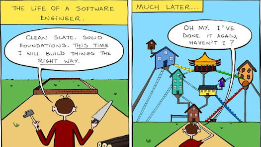
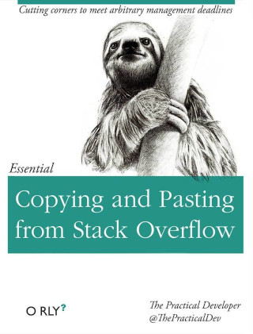
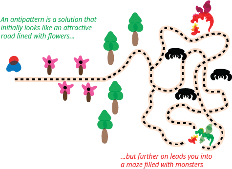
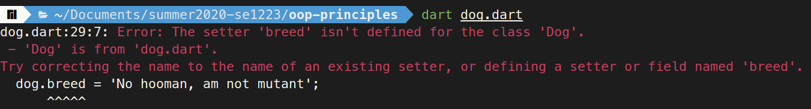

### Easy to learn, difficult to master

 <!-- .element style="width: 788px; height: 443px" -->


### Using an OO-language does not mean using OOP (properly)

* A codebase full of *antipatterns* is the quickest way to inspire someone to blog tech 
  ~~rant~~ articles like:
  + _"OOP's broken promises"_
  + _"OOP is a scam"_
  + _"Why I hate OOP"_
  + _"OOP is dangerous"_
  + or something along those lines
    - Disclaimer: OOP does have flaws, but fighting a mainstream paradigm is a losing fight
    - Flutter [has tons of OOP](https://flutter.dev/docs/resources/faq#what-programming-paradigm-does-flutters-framework-use), 
      has 100k stars and is not going away)


### What is an anti-pattern

<div style="display: flex">
  <ul style="flex: 1">
    <li>
      An anti-pattern is a common response to a recurring problem that is usually ineffective and 
      risks being highly counterproductive in the long run.
      <ul>
        </li></small>e.g. copy-paste programming</small></li>
      </ul>
    </li>
  </ul>
  
  <div style="flex: 1">
    
  </div>
</div>


### What is an anti-pattern



It's a bad practice, but it has a ~~seductive~~ enticing part that makes you want to use
those bad practices.


### Example of OOP antipattern:  Anemic Domain Model

The basic **symptom** of an **Anemic** Domain Model is that at first blush it looks like the real 
thing.  There are **objects**, many named after the **nouns** in the domain space, and these objects 
are connected with the rich relationships and structure that true domain models have. The catch 
comes when you look at the behavior, and you realize that there is **hardly any behavior** on these 
objects, making them little more than _bags of getters and setters_.


### A Dar~~k~~t secret: we get setters/getters for free

Proper terminology:  [**implicit** getters (and setters)](https://dart.dev/guides/language/language-tour#getters-and-setters)

```dart [3-9 | 11-18]
// dog.dart
class Dog {
  // these actually generate setters and getters
  String name; // I'll change the name of my dog someday
  int weight; // my dog can gain or lose weight

  // these are getters only, due to the final keyword
  final String breed; // dog breed is the same from birth
  final String dominantColor; // same with fur color!

  Dog({ // named parameters SHORTHAND!
    this.name, 
    this.weight, 
    this.breed, // breed and color won't change after
    this.dominantColor // getting set in the contructor
  }) {

  }
}
```


### Trying to change our mutant dog's breed

```dart
// main.dart
var dog = Dog(
  name: 'Fifi',
  weight: 50,
  breed: 'Shiranian',
  dominantColor: 'brown',
);

dog.name = 'Princess Fifi';
dog.breed = 'No hooman, am not mutant';
```




### Our anemic dog is just a bunch of (implicit) setters/getters

```dart [3-9 | 11-18 | 20]
// dog.dart
class Dog {
  // these actually generate setters and getters
  String name; // I'll change the name of my dog someday
  int weight; // my dog can gain or lose weight

  // these are getters only, due to the final keyword
  final String breed; // dog breed is the same from birth
  final String dominantColor; // same with fur color!

  Dog({ // named parameters SHORTHAND!
    this.name, 
    this.weight, 
    this.breed, // breed and color won't change after
    this.dominantColor // getting set in the contructor
  }) {

  }

  // you've reached the end, NO METHODS (NO BEHAVOR!)
}
```