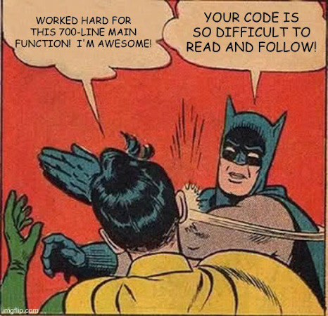

Tell Don't Ask
--------------


### Tell Don't Ask

Tell-Don't-Ask is a principle that helps people remember that object-orientation is about bundling 
data with the functions that operate on that data. It reminds us that rather than asking an object 
for data and acting on that data, we should instead tell an object what to do. This encourages to 
move **behavior** into an object to go with the data.

The simplest cure for anemic objects.


### Asking (it for data multiple times)


* This is **fake OOP**, even if the language is 
  [mainly OOP](https://en.wikipedia.org/wiki/Object-oriented_programming#OOP_languages). 
  - domain object is anemic
  - logic is elsewhere (e.g. static methods, or 😷😷 procedures)
    + or after you learn GUIs this term -- `saveButton.onPressed`


### Telling (it what to do)


+ This is how OOP should be, objects have:  
  - state (a.k.a. data, instance vars)
  - behavior (a.k.a. logic, methods)


### Let's triage suspect COVID-19 cases


### Anemic Domain Model for Patient

```dart [1-7 | 13 | 21 | 22 | 25 | 26]
class Patient {
  String name;
  double currentTemperature;
  List&lt;String&gt; otherSymptoms;
  DateTime lastTravelDate;
  bool hasExposure;
}

void main() {
  final fishy = Patient(/* ... */);
  var classification = 'normal';
  
  if (fishy.lastTravelDate == null) { // ask
    classification = 'normal';
    exit(0);
  }

  final twoWeeks = Duration(days: 14);
  final twoWeeksAgo = DateTime.now().subtract(twoWeeks);
  
  if (fishy.lastTravelDate.isAfter(twoWeeksAgo) || // ask
      fishy.hasExposure) { // ask
    classification = 'PUM';

    final symptoms = fishy.otherSymptoms; // ask
    if (fishy.currentTemperature >= 38 || // ask
        symptoms.contains('cough') ||
        symptoms.contains('shortness of breath')) {
      classification = 'PUI';
    }
  }
}
```

Beginners usually dump business logic in a main function or GUI event handlers that ask, ask, ask.


### Let's refactor

Code refactoring is the process of restructuring existing computer code **without changing its 
external** _(user-observable)_ **behavior.**  
* Some examples:
  - renaming a variable
  - eliminating repetitive code
  - decomposing your 1000-liner `void main()` into smaller, more manageable pieces
  - converting your triple-nested loop into three functions with a flat loop each


### We can just copy-paste `void main` into `Patient.triage()`

And find-replace all instances of `fishy` into `this`.  Can we do better?

* We do have a very long main function.  So let's take a short detour and introduce a principle 
  that's applicable to any kind of function.
  - functions (pure and impure)
  - procedures
  - methods


### Single Level of Abstraction Principle (SLAP)




### 👎 long, unreadable methods (1/3)


nested control structures are the most common symptom of functions that sorta look like this


### 👎 long, unreadable methods (2/3)


another symptom is the long function broken into logical sections, and some comments sprinkled


### 👎 long, unreadable methods (3/3)

+ Long functions/methods are:
  * hard to read and remember
    - since they are hard to follow
  * hard to test and debug
    - and will result in more bugs
  * conceal business rules
  * hard to reuse and lead to duplication
  * have a higher probability to change
  * harder to optimize
  * prone to obsolete comments
  * <u>\_\_\____insert your experience here___\_\_\_</u> (see Assignment Part 2 on Discord)


### 👍 short, readable methods (1/2)


break apart long functions into smaller pieces and ~~assemble~~ _compose_ them in some other 
function


### 👍 short, readable methods (2/2)


these logical sections should be extracted into methods or getters, whichever makes more sense


## Detour ends


* Let's start refactoring, and remember our goal is to abide by these principles:
  1. Tell Don't Ask
  2. Single Level of Abstraction Principle (SLAP)


### Prep a getter for privates

```dart [7-8 | 10-17]
class Patient {
  String name;
  double currentTemperature;
  List&lt;String&gt; otherSymptoms;
  DateTime lastTravelDate;
  bool hasExposure;
  String _classification; // we added 2 privates
  bool _triaged = false;

  String get classification { 
    if (!triaged) { // ensure classification is not null
      triage();     // and avoids sequential coupling
      _triaged = true;
    }

    return _classification;
  }

  bool get hasTravelHistory { return travelHistory != null; }
  bool get hasFever { return currentTemperature >= 38; }
  bool get hasRespiratorySymptoms {
    return otherSymptoms.contains('cough') ||
           otherSymptoms.contains('shortness of breath');
  }

  void triage() {
    _classification = 'normal';
    
    if (!hasTravelHistory) {
      return; // exit the method
    }

    final twoWeeks = Duration(days: 14);
    final twoWeeksAgo = DateTime.now().subtract(twoWeeks);
    
    if (hasRecentTravelHistory || hasExposure) {
      _classification = 'PUM';

      if (hasFever || hasRespiratorySymptoms) {
        _classification = 'PUI';
      }
    }
  }
}
```

<span class="fragment">Needing to `.triage()` before `.classification`</span>

<p class="fragment">
  is another antipattern: 
  <a href="https://en.wikipedia.org/wiki/Sequential_coupling">Sequential Coupling</a>
</p>


### Prep some computed props and a `triage` method

```dart [19-32 | 34-45]
class Patient {
  String name;
  double currentTemperature;
  List&lt;String&gt; otherSymptoms;
  DateTime lastTravelDate;
  bool hasExposureWithCovidPositive;
  String _classification; // we added 2 privates
  bool _triaged = false;

  String get classification { 
    if (!triaged) { // ensure classification is not null
      triage();     // and avoids sequential coupling
      _triaged = true;
    }

    return _classification;
  }

  bool get hasTravelled { return lastTravelDate != null; }

  bool get hasFever { return currentTemperature >= 38; }

  bool get hasRespiratorySymptoms {
    return otherSymptoms.contains('cough') ||
           otherSymptoms.contains('shortness of breath');
  }

  bool get hasRecentTravelHistory {
    final twoWeeks = Duration(days: 14);
    final twoWeeksAgo = DateTime.now().subtract(twoWeeks);
    return lastTravelDate.isAfter(twoWeeksAgo);
  }

  void triage() {
    _classification = 'normal';    
    if (!hasTravelled) return; // exit the method

    if (hasRecentTravelHistory || hasExposure) {
      _classification = 'PUM';

      if (hasFever || hasRespiratorySymptoms) {
        _classification = 'PUI';
      }
    }
  }
}
```

<span class="fragment">
  `Patient` is no longer anemic!
</span>


### TELL the `Patient` object what to do, AND NOT ASK, ASK, ASK

```dart
void main() {
  final suspectCase = Patient(/* ... */);
  suspectCase.triage(); // called by the getter if you forget
  print("DOH Classification: ${suspectCase.classification}");
}
```

* Wait, move some code around and all that to shorten main to 3 lines? <!--  .element class="fragment" -->
  <ul>
    <li class="fragment">
      This goes deeper, to repeat -- <i>ask, ask, and ask</i> and your Flutter code in the future
      will have tons of  <b><i>business logic</i></b> code inside things like 
      `triageButton.onPressed`.
    </li>
    <li class="fragment">
      advanced student?  check your MVC code for fat controllers
    </li>
  </ul>


### And yup, sometimes refactoring is just moving around some code


### Our new code is more readable

+ It's properly structured and easier to navigate. 
  - Professional software engineers will look for business logic in your domain model classes 
  - so **Tell, Don't Ask**!

+ **Effective Dart** also has this recommendation:
  - **CONSIDER** making the code read like a sentence.
    * When in doubt about naming, write some code that uses your ~~API~~ classes and methods, and 
      try to read it like a sentence.
  - So try to SLAP your code.


### What if I can't find a behavior?

* Then it's just a class that holds some data, don't force it.
  - with every rule there's an exception
  - that's why it's called a **principle**, not a **law**
    + like law of gravity or Newton's laws
  - intuition will improve with experience
  - some apps are just that
    + save data ➡ load data ➡ repeat
  - they're friendly reminders
    + <span style="color: green">👍</span> Tell Don't Ask is a reminder what OOP is about
    + <span style="color: red">👎 </span> and Anemic Domain Model is a reminder what OOP isn't about
    + <span style="color: green">👍</span> SLAP makes our code more readable