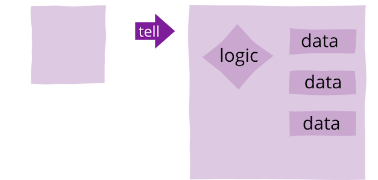
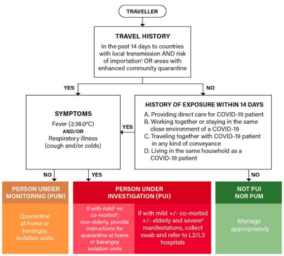
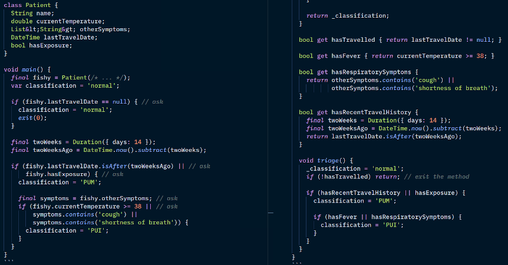

Tell Don't Ask
--------------


### Tell Don't Ask

Tell-Don't-Ask is a principle that helps people remember that object-orientation is about bundling 
data with the functions that operate on that data. It reminds us that rather than asking an object 
for data and acting on that data, we should instead tell an object what to do. This encourages to 
move **behavior** into an object to go with the data.

The simplest cure for anemic objects.


### Asking (it for data multiple times)


* This is **fake OOP**, even if the language is 
  [mainly OOP](https://en.wikipedia.org/wiki/Object-oriented_programming#OOP_languages). 
  - domain object is anemic
  - logic is elsewhere (e.g. static methods, or 😷😷 procedures)
    + or after you learn GUIs this term -- `saveButton.onPressed`


### Telling (it what to do)



+ This is how OOP should be, objects have:  
  - state (a.k.a. data, instance vars)
  - behavior (a.k.a. logic, methods)


### Let's triage suspect COVID-19 cases




### Anemic Domain Model for Patient

```dart [1-7 | 13 | 21 | 22 | 25 | 26]
class Patient {
  String name;
  double currentTemperature;
  List&lt;String&gt; otherSymptoms;
  DateTime lastTravelDate;
  bool hasExposure;
}

void main() {
  final fishy = Patient(/* ... */);
  var classification = 'normal';
  
  if (fishy.lastTravelDate == null) { // ask
    classification = 'normal';
    exit(0);
  }

  final twoWeeks = Duration({ days: 14 });
  final twoWeeksAgo = DateTime.now().subtract(twoWeeks);
  
  if (fishy.lastTravelDate.isAfter(twoWeeksAgo) || // ask
      fishy.hasExposure) { // ask
    classification = 'PUM';

    final symptoms = fishy.otherSymptoms; // ask
    if (fishy.currentTemperature >= 38 || // ask
        symptoms.contains('cough') ||
        symptoms.contains('shortness of breath')) {
      classification = 'PUI';
    }
  }
}
```

Beginners usually dump business logic in a main function or GUI event handlers that ask, ask, ask.


### Let's refactor

Code refactoring is the process of restructuring existing computer code **without changing its 
external** _(user-observable)_ **behavior.**  
* Some examples:
  - renaming a variable
  - eliminating repetitive code
  - decomposing your 1000-liner `void main()` into smaller, more manageable pieces
  - converting your triple-nested loop into three functions with a flat loop each


### Prep a getter for privates

```dart [7-8 | 10-17]
class Patient {
  String name;
  double currentTemperature;
  List&lt;String&gt; otherSymptoms;
  DateTime lastTravelDate;
  bool hasExposure;
  String _classification; // we added 2 privates
  bool _triaged = false;

  String get classification { 
    if (!triaged) { // ensure classification is not null
      triage();     // and avoids sequential coupling
      _triaged = true;
    }

    return _classification;
  }

  bool get hasTravelHistory { return travelHistory != null; }
  bool get hasFever { return currentTemperature >= 38; }
  bool get hasRespiratorySymptoms {
    return otherSymptoms.contains('cough') ||
           otherSymptoms.contains('shortness of breath');
  }

  void triage() {
    _classification = 'normal';
    
    if (!hasTravelHistory) {
      return; // exit the method
    }

    final twoWeeks = Duration({ days: 14 });
    final twoWeeksAgo = DateTime.now().subtract(twoWeeks);
    
    if (hasRecentTravelHistory || hasExposure) {
      classification = 'PUM';

      if (hasFever || hasRespiratorySymptoms) {
        classification = 'PUI';
      }
    }
  }
}
```

<span class="fragment">Needing to `.triage()` before `.classification`</span>

<p class="fragment">
  is another antipattern: 
  <a href="https://en.wikipedia.org/wiki/Sequential_coupling">Sequential Coupling</a>
</p>


### Prep some computed props

```dart [19-32 | 34-45]
class Patient {
  String name;
  double currentTemperature;
  List&lt;String&gt; otherSymptoms;
  DateTime lastTravelDate;
  bool hasExposureWithCovidPositive;
  String _classification; // we added 2 privates
  bool _triaged = false;

  String get classification { 
    if (!triaged) { // ensure classification is not null
      triage();     // and avoids sequential coupling
      _triaged = true;
    }

    return _classification;
  }

  bool get hasTravelled { return lastTravelDate != null; }

  bool get hasFever { return currentTemperature >= 38; }

  bool get hasRespiratorySymptoms {
    return otherSymptoms.contains('cough') ||
           otherSymptoms.contains('shortness of breath');
  }

  bool get hasRecentTravelHistory {
    final twoWeeks = Duration({ days: 14 });
    final twoWeeksAgo = DateTime.now().subtract(twoWeeks);
    return lastTravelDate.isAfter(twoWeeksAgo);
  }

  void triage() {
    _classification = 'normal';    
    if (!hasTravelled) return; // exit the method

    if (hasRecentTravelHistory || hasExposure) {
      classification = 'PUM';

      if (hasFever || hasRespiratorySymptoms) {
        classification = 'PUI';
      }
    }
  }
}
```

<span class="fragment">
  `Patient` is no longer anemic, it has behavior bundled with state inside the class!
</span>


### TELL the `Patient` object what to do, AND NOT ASK, ASK, ASK

```dart
void main() {
  final suspectCase = Patient(/* ... */);
  suspectCase.triage(); // called by the getter if you forget
  print("DOH Classification: ${suspectCase.classification}");
}
```

* Wait, you just moved around some code && shortened the main function! <!--  .element class="fragment -->
  <ul>
    <li class="fragment">
      This goes deeper, to repeat -- <i>ask, ask, and ask</i> and your Flutter code in the future
      will have tons of  <b><i>business logic</i></b> code inside things like 
      `triageButton.onPressed`.
    </li>
    <li class="fragment">
      advanced student?  check your MVC code for fat controllers</small>
    </li>
  </ul>
  


### And yup, sometimes refactoring is just moving around some code




### But our new code is more readable

If you've already read **Effective Dart**, you might have encountered this recommendation:
+ **CONSIDER** making the code read like a sentence.

> When in doubt about naming, write some code that uses your ~~API~~ classes and methods, and 
> try to read it like a sentence.
